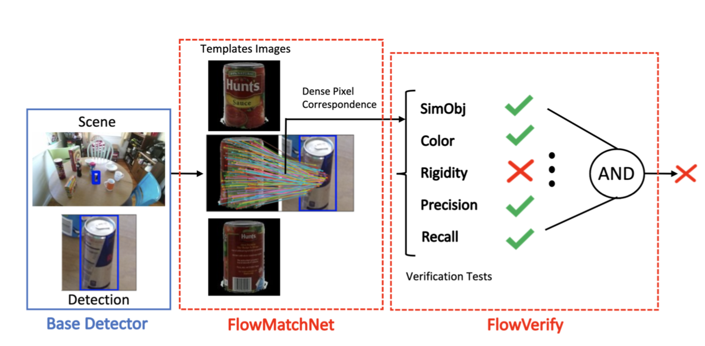

### Abstract

Deep learning based object detectors often report false positives with very high confidence. Although they optimize generic detection performance, such as mean average precision (mAP), they are not designed for robustness or verifiability. We argue that, if a high confidence detection is made by a robot perception system, we would want high certainty that the object has indeed been detected. We present a detection system that can verify, with high precision, whether each detection of a machine-learning based object detector is correct or not. We present a set of verification checks based on a novel approach of using dense pixel correspondences between known images of objects and a scene, to verify whether the detections made in the scene are correct. We motivate this by developing a theoretical framework which proves that under certain assumptions, our proposed method will reject any false positives. We show that these tests can improve the overall accuracy of a base detector and that accepted examples are highly likely to be correct. This allows the detector to operate in a high precision regime, and can thus be used for robotic perception systems as a reliable instance detection method. Code is available at [https://github.com/siddancha/FlowVerify](https://github.com/siddancha/FlowVerify).

### Paper
Siddharth Ancha, Junyu Nan, David Held 
Combining Deep Learning and Verification for Precise Object Instance Detection [arxiv](https://arxiv.org/abs/1912.12270) 
Conference on Robot Learning (CoRL 2019)

### Video

### Acknowledgments

This material is based upon work supported by the United States Air Force and DARPA under
Contract No. FA8750-18-C-0092 as well as by the NSF under Grant No. IIS-1849154.
